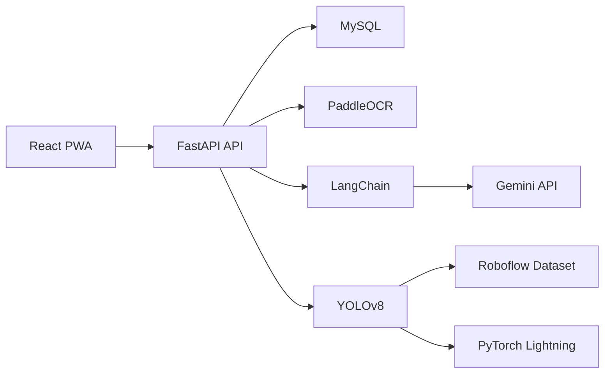

# 계약서 분석 AI 개발 가이드

## 1. 문서 목적

이 문서는 계약서 분석 AI 시스템을 4명이 1개월 안에 시연 가능한 수준으로 구현하기 위한 기술 스택 추천과 개발 기준을 정리한 가이드다. 목표는 법률 전문가를 대체하는 것이 아니라 계약서 사전 검토를 돕는 AI 보조 시스템 구현이다.

## 2. 최종 기술 스택

| 구분 | 기술 스택 | 활용 내용 |
| --- | --- | --- |
| 프론트엔드 | React, TypeScript | 계약서 업로드, 분석 결과 조회, 질의응답 화면 등 사용자 인터페이스 구현 |
| 웹 앱 형태 | PWA | 모바일과 노트북에서 앱처럼 실행 가능한 웹 서비스 형태 제공 |
| 백엔드 | FastAPI, Pydantic | 파일 업로드 처리, 계약서 분석 요청, AI 결과 반환, API 서버 구축 |
| 데이터베이스 | MySQL | 사용자 정보, 계약서 메타데이터, 분석 결과, 질의응답 로그 저장 |
| AI 문서 분석 | Gemini API | 계약 유형 분류, 핵심 정보 추출, 위험 조항 분석, 요약, 문서 질의응답 |
| AI 오케스트레이션 | LangChain | OCR 결과와 LLM 연결, 검색, 프롬프트 체인, 근거 기반 질의응답 파이프라인 구성 |
| OCR 프레임워크 | PaddleOCR | 스캔 계약서와 이미지 문서에서 텍스트 추출 및 문서 구조 인식 |
| 객체 탐지 프레임워크 | Ultralytics YOLOv8 | 계약서 이미지 내 인감, 서명, 체크 표식 등 시각적 요소 탐지 |
| 데이터셋 관리 | Roboflow | 객체 탐지용 이미지 데이터 수집, 라벨링, 전처리 및 버전 관리 |
| 딥러닝 프레임워크 | PyTorch | YOLOv8 기반 객체 탐지 모델 학습 및 추론 환경 구성 |
| 학습 관리 프레임워크 | PyTorch Lightning | 모델 학습 루프 관리, 실험 재현성 확보, 학습 코드 구조화 |
| UI/UX 설계 | Figma | 화면 설계, 사용자 흐름 정의, 프로토타입 제작 |

## 3. 스택 선정 이유

### 왜 이 조합이 맞는가

- `React + PWA`는 업로드와 결과 조회 중심 서비스에 적합하다.
- `FastAPI`는 OCR, LLM, 객체 탐지 모듈을 API 형태로 묶기 쉽다.
- `MySQL`은 팀 프로젝트에서 사용하기 익숙하고 정형 데이터 저장에 안정적이다.
- `Gemini API`는 장문 계약서 분석, 구조화 출력, 질의응답에 적합하다.
- `LangChain`은 OCR 결과와 LLM을 연결하는 파이프라인 계층으로 유용하다.
- `PaddleOCR`은 계약서 스캔본 텍스트 추출과 문서 구조 인식에 적합하다.
- `YOLOv8`은 인감, 서명, 체크 요소처럼 시각 객체를 탐지하는 데 적합하다.
- `Roboflow`는 YOLO 학습 데이터셋 라벨링과 버전 관리를 쉽게 해준다.
- `PyTorch + PyTorch Lightning`은 모델 학습과 실험 관리에 적합하다.

### 역할 분리 원칙

- `PaddleOCR`: 텍스트 추출 담당
- `Gemini API`: 계약 내용 이해와 생성 담당
- `LangChain`: 검색 및 프롬프트 체인 담당
- `YOLOv8`: 인감, 서명 등 시각 요소 탐지 담당
- `MySQL`: 분석 결과와 이력 저장 담당

## 4. MVP 범위

### 반드시 포함

1. PDF, 이미지, 텍스트 업로드
2. OCR 기반 텍스트 추출
3. 조항 분리
4. 계약 유형 분류
5. 핵심 필드 추출
6. 위험 조항 탐지
7. 계약서 요약
8. 근거 조항 기반 질의응답
9. 인감, 서명 등 시각 요소 탐지
10. 분석 결과 화면

### 1차 제외

1. 모든 계약 유형 지원
2. 판례 기반 답변
3. 조항 수정 제안 자동 생성
4. 협업 워크플로우
5. 고급 모델 재학습 자동화

## 5. 권장 아키텍처

### 처리 흐름

1. 사용자가 계약서를 업로드한다.
2. FastAPI가 파일을 수신하고 유형을 구분한다.
3. 이미지 또는 스캔 문서는 PaddleOCR로 텍스트를 추출한다.
4. 계약서 이미지에서 인감, 서명, 체크 표식 등은 YOLOv8으로 탐지한다.
5. OCR 결과와 탐지 결과를 기반으로 조항 분리와 필드 후보 추출을 수행한다.
6. LangChain 파이프라인이 Gemini API를 호출해 유형 분류, 핵심 정보 추출, 요약, 질의응답을 수행한다.
7. 분석 결과와 로그를 MySQL에 저장한다.
8. 프론트엔드에서 핵심 필드, 위험 조항, 근거 조항, 객체 탐지 결과를 시각화한다.

## 6. 백엔드 설계 기준

### 서비스 분리

- `api`: 라우터와 요청/응답 스키마
- `services`: 업로드, 분석 오케스트레이션, 질의응답
- `parsers`: OCR 정제, 조항 분리, 필드 후보 추출
- `rules`: 위험 조항 탐지 룰
- `integrations`: Gemini, MySQL, PaddleOCR, YOLOv8, LangChain
- `workers`: 장시간 분석 작업 실행

### 핵심 테이블

#### documents

- `id`
- `user_id`
- `title`
- `contract_type`
- `source_file_path`
- `source_file_mime`
- `status`
- `created_at`
- `updated_at`

#### extractions

- `document_id`
- `counterparty_a`
- `counterparty_b`
- `signing_date`
- `start_date`
- `end_date`
- `amount_text`
- `amount_value`
- `currency`
- `has_termination_clause`
- `has_liability_clause`
- `has_confidentiality_clause`
- `has_dispute_clause`
- `raw_json`

#### risk_flags

- `document_id`
- `clause_id`
- `risk_type`
- `severity`
- `reason`
- `suggested_checkpoint`
- `evidence_text`

#### qa_logs

- `document_id`
- `question`
- `answer`
- `evidence_clause_ids`
- `created_at`

#### vision_detections

- `document_id`
- `detection_type`
- `label`
- `confidence`
- `bbox_json`
- `created_at`

### API 초안

- `POST /api/v1/documents`
- `POST /api/v1/documents/{id}/upload`
- `POST /api/v1/documents/{id}/analyze`
- `GET /api/v1/documents/{id}`
- `GET /api/v1/documents/{id}/summary`
- `GET /api/v1/documents/{id}/extractions`
- `GET /api/v1/documents/{id}/risks`
- `GET /api/v1/documents/{id}/clauses`
- `GET /api/v1/documents/{id}/detections`
- `POST /api/v1/documents/{id}/qa`

## 7. AI 및 ML 처리 가이드

### 모델 선택 기준

- Gemini 모델은 추후 확정하되, 구조화 출력과 문서 질의응답 성능을 우선 기준으로 선택한다.
- YOLOv8은 인감, 서명, 체크 표식처럼 시각적 객체 탐지가 필요한 범위로 한정한다.

### 분석 파이프라인

1. 파일 유형 판별
2. OCR 수행
3. 시각 요소 탐지 수행
4. 조항 분리
5. 필드 후보 추출
6. LangChain 체인 구성
7. Gemini 구조화 출력 호출
8. 위험 조항 룰 적용
9. 요약 생성
10. 근거 기반 질의응답 수행

### OCR 및 비전 처리 원칙

- PaddleOCR을 기본 OCR 프레임워크로 사용한다.
- OCR 품질이 낮은 경우 전처리 후 재시도한다.
- YOLOv8 탐지 결과는 텍스트 분석 결과와 별도 저장 후 최종 화면에서 함께 제공한다.
- Roboflow에서 데이터셋 버전을 관리한다.
- 모델 학습 및 실험 관리는 PyTorch Lightning 기준으로 정리한다.

### 구조화 출력 원칙

- Gemini 응답은 JSON Schema 형태로 강제한다.
- 날짜는 ISO 형식으로 정규화한다.
- 금액은 문자열과 수치 값을 분리 저장한다.
- 추출 불가 항목은 `null`과 사유를 함께 남긴다.
- 모든 답변은 가능한 경우 근거 조항을 포함한다.

## 8. 프론트엔드 가이드

### 핵심 화면

1. 로그인
2. 계약서 업로드
3. 문서 목록
4. 분석 결과 대시보드
5. 조항 보기
6. 질문하기
7. 이미지 탐지 결과 보기

### UX 원칙

- 분석 중 상태를 명확히 표시한다.
- 핵심 정보와 위험 조항을 먼저 보여준다.
- 질의응답 결과에는 근거 조항을 함께 제공한다.
- 이미지 탐지 결과는 원본 계약서 위에 박스 형태로 표시할 수 있게 설계한다.
- "AI 보조 결과이며 법률 자문이 아님" 문구를 고정 노출한다.

## 9. 개발 우선순위

### 1주차

- React 프로젝트 초기 세팅
- PWA 설정
- FastAPI 서버 초기 세팅
- MySQL 스키마 초안
- Gemini, PaddleOCR, YOLOv8 연결 테스트

### 2주차

- 조항 분리
- 핵심 필드 추출
- OCR 처리 흐름 연결
- 객체 탐지 결과 저장
- 분석 결과 조회 API 구현

### 3주차

- 위험 조항 탐지
- 요약
- 질의응답
- 프론트 분석 결과 화면 고도화

### 4주차

- 테스트
- 예외 처리
- 데모 계약서와 시연 흐름 고정
- 성능 및 UI 마감

## 10. 테스트 전략

### 필수 테스트

- OCR 결과 검증 테스트
- 조항 분리 유닛 테스트
- 날짜/금액 추출 유닛 테스트
- 리스크 탐지 유닛 테스트
- YOLO 탐지 결과 확인 테스트
- 문서 업로드 API 테스트
- 분석 완료 후 결과 조회 통합 테스트

### 품질 기준

- OCR 실패 시 사용자에게 재업로드 가이드를 제공한다.
- 질의응답은 근거 조항이 없으면 제한적으로 답변한다.
- 탐지 결과와 텍스트 분석 결과를 분리 저장한다.
- 스캔 품질이 낮은 문서는 경고 메시지를 노출한다.

## 11. 최종 권고

이 프로젝트는 텍스트 분석과 이미지 분석이 함께 들어가므로 기술 스택의 역할 구분을 명확히 해야 한다. Gemini는 계약 내용 이해를 담당하고, PaddleOCR은 텍스트 추출을 담당하며, YOLOv8은 인감과 서명 같은 시각 요소 탐지를 담당한다. LangChain은 이 흐름을 연결하는 오케스트레이션 계층으로 두는 것이 적절하다.

## 12. 참고 문서

- [Gemini structured output](https://ai.google.dev/gemini-api/docs/structured-output)
- [Gemini document processing](https://ai.google.dev/gemini-api/docs/document-processing)
- [Gemini models](https://ai.google.dev/models/gemini)
- [FastAPI file upload](https://fastapi.tiangolo.com/tutorial/request-files/)
- [PWA overview](https://web.dev/learn/pwa/)
- [MySQL documentation](https://dev.mysql.com/doc/)
- [LangChain structured output](https://docs.langchain.com/oss/python/langchain/structured-output)
- [PaddleOCR](https://www.paddleocr.ai/latest/en/index.html)
- [Ultralytics Docs](https://docs.ultralytics.com/)
- [Roboflow Docs](https://docs.roboflow.com/)
- [PyTorch Docs](https://docs.pytorch.org/docs/main/index.html)
- [PyTorch Lightning](https://lightning.ai/docs/pytorch/LTS/index.html)
